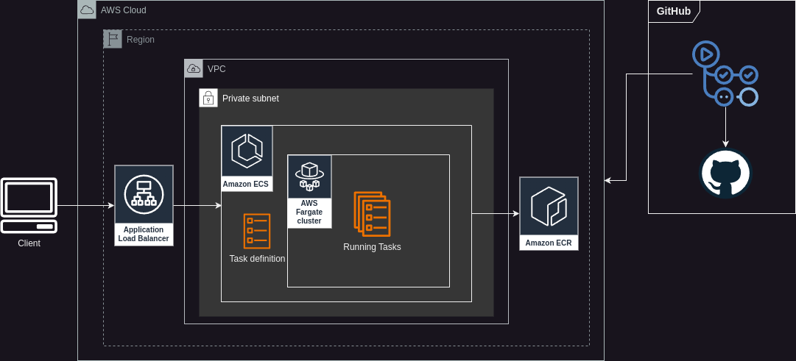

# Cloud Architecture

The challenge requires the use of ECR and ECS for two different apps running and a resource to use as a unique public access to the apps, in this case, a ***Load Balancer*** because of its capabilities to distribute the traffic to the required app and there is no nedd of the advanced API management features that provides API Gateway.

After analyzing the requirements, the cloud architecture is:

# IaaC 

**Tool:** Terraform

**Advantages:**
* Experience: Prior knowledge of terraform makes the learning curve less than AWS CDK.
* Multicloud: Terraform is vendor agnostic, ideal if you need to manage infrastructure across multiple clouds in the future.
* Community and Ecosystem: Terraform has a large community and mature ecosystem, facilitating module reuse and adoption of best practices.
Advantages:
* Granular Control: Provides fine-grained control over infrastructure resources.
* Extensive Support: Compatible with multiple vendors and services, providing flexibility.

**Disadvantages:**
* HCL Language: Less expressive compared to full programming languages.
* State Management: Requires careful state management, which can be complex on large equipment.

# CI/CD
**Tool:** Github Actions

**Reasons:**
* Native Integration: GitHub Actions is directly integrated with GitHub, which simplifies configuration and management of pipelines.
* Ease of Use: It is easy to use and does not require additional infrastructure management, unlike Jenkins, which needs to be self-hosted and maintained.
* Quick Configuration: Allows CI/CD pipelines to be configured quickly within the same repository.
* Reduced Maintenance: Does not require server management or additional infrastructure, which reduces the operational burden.

**Disadvantages:**
* Limited Scalability: For very large or complex projects, GitHub Actions may have limitations compared to more robust solutions such as Jenkins.
* High Volume Costs: Depending on usage, costs may increase over time, especially in public or run-intensive repositories.
